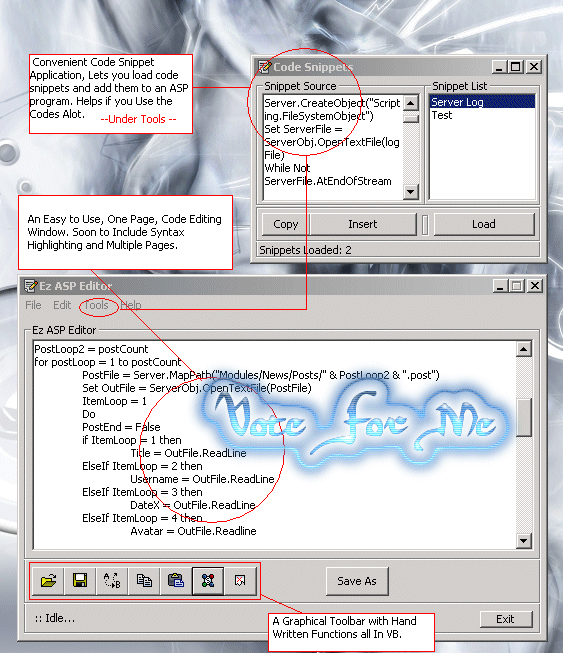



## Ez ASP Editor

### Description

Ez ASP Editor is an ongoing project of mine. I started it because i had no ASP editor... plenty of HTML editors out there, none of these. It is a text-editor with a Code Snippet Loader. View the ScreenShot to see. It just makes life easier for ASP programmers, the Snippet loader will let you load snippets from a directory, codes within this directory are normally "frequently used" codes, that you don't feel like retyping. it has a graphical toolbar with all handwritten functions in VB of course! No API
 
### More Info
 

             |
---                |---
**Submitted On**   |2002-09-01 04:11:42
**By**             |[Robert Cleaver](https://github.com/Planet-Source-Code/PSCIndex/blob/master/ByAuthor/robert-cleaver.md)
**Level**          |Advanced
**User Rating**    |4.5 (18 globes from 4 users)
**Compatibility**  |VB 6\.0
**Category**       |[Complete Applications](https://github.com/Planet-Source-Code/PSCIndex/blob/master/ByCategory/complete-applications__1-27.md)
**World**          |[Visual Basic](https://github.com/Planet-Source-Code/PSCIndex/blob/master/ByWorld/visual-basic.md)
**Archive File**   |[Ez\_ASP\_Edi125223912002\.zip](https://github.com/Planet-Source-Code/robert-cleaver-ez-asp-editor__1-38553/archive/master.zip)

